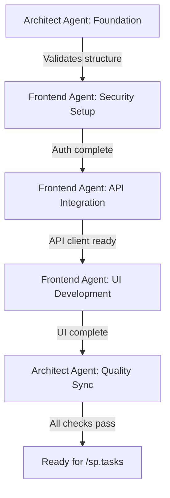

# Implementation Plan: Professional-Grade Next.js Frontend with Modern UI/UX

**Branch**: `001-nextjs-frontend-auth` | **Date**: 2026-01-08 | **Spec**: [spec.md](./spec.md)
**Input**: Feature specification from `/specs/001-nextjs-frontend-auth/spec.md`

## Summary

Build a professional-grade Next.js 15+ frontend application featuring modern UI/UX with Better Auth JWT authentication, TanStack Query for server-state management, Shadcn UI components, and Framer Motion animations. The application provides seamless authentication flows (sign-up/sign-in) with real-time validation, an interactive task management dashboard with priority-based color coding and smooth transitions, and optimized performance using Next.js streaming and suspense boundaries. This frontend integrates with a FastAPI backend via RESTful APIs with automatic JWT token attachment.

**Agent-Based Execution Strategy**: Orchestrate specialized agents (Frontend Agent, Backend Agent, Architect Agent) using custom skills library (`@skills/nextjs`, `@skills/better-auth`, `@skills/fastapi`, `@skills/sqlmodel`) to ensure constitution compliance, architectural separation, and security by isolation.

## Technical Context

**Language/Version**: TypeScript 5.3+ with strict mode enabled
**Primary Framework**: Next.js 15.0+ (App Router - NOT Pages Router)
**UI Dependencies**:
  - Shadcn UI (component library)
  - Tailwind CSS 3.4+ (styling)
  - Lucide React (iconography)
  - Framer Motion 11+ (animations)
**Authentication**: Better Auth with JWT plugin
**State Management**: TanStack Query (React Query) v5+ for server-state and caching
**HTTP Client**: Axios or native Fetch API with interceptors
**Form Handling**: React Hook Form with Zod validation
**Testing**: Jest + React Testing Library (unit/integration), Playwright (e2e)
**Target Platform**: Modern web browsers (Chrome, Firefox, Safari, Edge - latest 2 versions)
**Project Type**: Web application (monorepo with `/frontend` and `/backend` separation)
**Performance Goals**:
  - Initial page load < 1 second (critical content via streaming)
  - Task operations feedback < 100ms (optimistic updates)
  - Lighthouse score 90+ (desktop), 80+ (mobile)
  - 60 FPS animations
**Constraints**:
  - Single-page dashboard (no complex multi-page navigation)
  - No heavy state libraries (Redux, MobX, Recoil)
  - No placeholder text (professional copy only)
  - Must follow Shadcn UI patterns
  - Must use App Router (Server Components where appropriate)
**Scale/Scope**:
  - 10+ reusable UI components (buttons, inputs, cards, dialogs)
  - 5+ feature components (auth forms, task cards, dashboard)
  - 3 main routes (sign-in, sign-up, dashboard)
  - ~2000-3000 lines of frontend code

## Constitution Check

*GATE: Must pass before Phase 0 research. Re-check after Phase 1 design.*

### I. Spec-Driven Supremacy ✅ PASS

- [x] Specification validated and approved (`specs/001-nextjs-frontend-auth/spec.md`)
- [x] All requirements checklist passed (see `checklists/requirements.md`)
- [x] Implementation will reference validated spec for all development decisions
- [x] Any code-spec conflicts will trigger spec refinement, not ad-hoc code changes

**Status**: Gate PASSED - Spec is complete with zero [NEEDS CLARIFICATION] markers

---

### II. Architectural Separation ✅ PASS

- [x] Frontend operates as independent deployable service in `/frontend` directory
- [x] Backend communication exclusively via RESTful API endpoints (documented in contracts/)
- [x] No direct backend database access from frontend
- [x] Independent environment configuration (`.env.local` for frontend)
- [x] API contracts documented in `specs/001-nextjs-frontend-auth/contracts/`

**Status**: Gate PASSED - Clear separation maintained; frontend is standalone Next.js app

---

### III. Security by Isolation ✅ PASS

- [x] JWT tokens carry `user_id` for server-side verification
- [x] Frontend never stores or trusts user_id from UI state for authorization decisions
- [x] All API requests include JWT in Authorization header for backend verification
- [x] Multi-user isolation enforced by backend (frontend displays only authenticated user's data)
- [x] No global/shared state for user-specific data in frontend

**Status**: Gate PASSED - Frontend delegates all authorization to backend via JWT

---

### IV. Agent-Led Execution ✅ PASS

- [x] **Frontend Agent** (`nextjs-frontend-developer`) handles UI components and auth integration
- [x] **Backend Agent** (`fastapi-backend-builder`) handles API contracts definition
- [x] **Architect Agent** (`architecture-architect`) ensures cross-service compatibility
- [x] Skills referenced: `@skills/nextjs`, `@skills/better-auth`
- [x] PHR created under `history/prompts/001-nextjs-frontend-auth/`

**Status**: Gate PASSED - Plan specifies agent assignments and skill usage

---

### V. Stateless Authentication ✅ PASS

- [x] Frontend uses Better Auth to generate JWT tokens
- [x] JWT tokens stored in HTTP-only cookies or secure localStorage
- [x] No session state maintained in frontend beyond token storage
- [x] Backend verifies JWT on every request (frontend assumes stateless backend)
- [x] `BETTER_AUTH_SECRET` environment variable configured in frontend `.env.local`

**Status**: Gate PASSED - JWT-only authentication; no session storage logic in frontend

---

### VI. API Security & Ownership Enforcement ✅ PASS

- [x] Frontend does NOT implement authorization logic
- [x] All API requests to `/api/tasks` endpoints include `Authorization: Bearer <token>` header
- [x] Frontend trusts backend to enforce user_id matching from JWT
- [x] Error handling implemented for 401 (unauthorized) and 403 (forbidden) responses
- [x] Frontend never includes user_id in request URLs (backend extracts from JWT)

**Status**: Gate PASSED - Frontend delegates ownership enforcement to backend

---

### VII. Environment Management ✅ PASS

- [x] All secrets stored in `.env.local` (frontend) and `.env` (backend)
- [x] `BETTER_AUTH_SECRET` loaded via `process.env.BETTER_AUTH_SECRET`
- [x] `NEXT_PUBLIC_API_BASE_URL` loaded via `process.env.NEXT_PUBLIC_API_BASE_URL`
- [x] `.env.local` listed in `.gitignore`
- [x] `.env.example` provided with placeholder values

**Status**: Gate PASSED - No hardcoded credentials; environment-based configuration

---

## Project Structure

### Documentation (this feature)

```text
specs/001-nextjs-frontend-auth/
├── spec.md                  # Feature specification (COMPLETED)
├── plan.md                  # This file (IN PROGRESS)
├── research.md              # Phase 0 output (TO BE CREATED)
├── data-model.md            # Phase 1 output (TO BE CREATED)
├── quickstart.md            # Phase 1 output (TO BE CREATED)
├── contracts/               # Phase 1 output (TO BE CREATED)
│   ├── auth-api.yaml        # OpenAPI spec for auth endpoints
│   └── tasks-api.yaml       # OpenAPI spec for task endpoints
├── checklists/
│   └── requirements.md      # Spec quality checklist (COMPLETED)
└── tasks.md                 # Phase 2 output (/sp.tasks command - NOT YET)
```

### Source Code (repository root)

```text
frontend/
├── src/
│   ├── app/                     # Next.js App Router
│   │   ├── layout.tsx           # Root layout with providers
│   │   ├── page.tsx             # Landing/redirect page
│   │   ├── (auth)/              # Auth route group
│   │   │   ├── signin/
│   │   │   │   └── page.tsx     # Sign-in page
│   │   │   └── signup/
│   │   │       └── page.tsx     # Sign-up page
│   │   └── dashboard/
│   │       └── page.tsx         # Task dashboard (protected)
│   ├── components/
│   │   ├── ui/                  # Shadcn UI reusable components
│   │   │   ├── button.tsx
│   │   │   ├── input.tsx
│   │   │   ├── card.tsx
│   │   │   ├── label.tsx
│   │   │   ├── dialog.tsx
│   │   │   └── ...
│   │   └── features/            # Feature-specific components
│   │       ├── auth/
│   │       │   ├── SignUpForm.tsx
│   │       │   ├── SignInForm.tsx
│   │       │   └── PasswordStrength.tsx
│   │       └── tasks/
│   │           ├── TaskCard.tsx
│   │           ├── TaskList.tsx
│   │           ├── TaskForm.tsx
│   │           └── EmptyState.tsx
│   ├── lib/
│   │   ├── auth-client.ts       # Better Auth configuration
│   │   ├── api-client.ts        # Axios/Fetch wrapper with JWT interceptors
│   │   ├── query-client.ts      # TanStack Query configuration
│   │   └── utils.ts             # Utility functions (cn, etc.)
│   ├── hooks/
│   │   ├── useAuth.ts           # Authentication hook
│   │   ├── useTasks.ts          # Task CRUD hooks (TanStack Query)
│   │   └── useToast.ts          # Toast notifications
│   ├── types/
│   │   ├── auth.ts              # Auth-related types
│   │   ├── task.ts              # Task entity types
│   │   └── api.ts               # API response types
│   └── styles/
│       └── globals.css          # Tailwind imports + custom styles
├── public/
│   └── empty-state.svg          # Empty state illustration
├── .env.local                   # Environment variables (gitignored)
├── .env.example                 # Example environment variables
├── next.config.js               # Next.js configuration
├── tailwind.config.ts           # Tailwind configuration
├── tsconfig.json                # TypeScript configuration
├── package.json                 # Dependencies
└── package-lock.json            # Locked dependencies

backend/
├── src/                         # Backend API (documented for reference)
│   ├── models/
│   ├── services/
│   └── api/
└── tests/

.claude/
├── agents/                      # Custom development agents
│   ├── nextjs-frontend-developer.md
│   ├── fastapi-backend-builder.md
│   └── architecture-architect.md
└── skills/                      # Reusable technology skills
    ├── nextjs/skill.md
    ├── better-auth/skill.md
    ├── fastapi/skill.md
    └── sqlmodel/skill.md

history/
└── prompts/
    └── 001-nextjs-frontend-auth/
        ├── 001-nextjs-frontend-spec-creation.spec.prompt.md
        └── 002-nextjs-frontend-plan-creation.plan.prompt.md (THIS FILE'S PHR)
```

**Structure Decision**: Web application structure (Option 2) selected because this is a full-stack project with separate frontend (Next.js) and backend (FastAPI) services. Monorepo organization maintains architectural separation while enabling shared documentation in `/specs` and agent coordination via `.claude/`. Frontend code lives exclusively in `/frontend`, backend in `/backend`.

## Complexity Tracking

> **No violations detected - all constitution principles satisfied**

This section intentionally left empty as no complexity justifications are required.

---

## Phase 0: Research & Architectural Decisions

**Objective**: Resolve technical unknowns, research best practices, and document architectural decisions for Better Auth integration, Shadcn UI setup, TanStack Query patterns, and Framer Motion animation strategies.

### Research Tasks

#### RT-001: Better Auth JWT Integration with Next.js 15 App Router

**Question**: How to configure Better Auth with JWT plugin in Next.js 15 App Router, including token storage, refresh mechanisms, and server/client component patterns?

**Research Approach**:
- Review Better Auth official documentation for Next.js 15 compatibility
- Examine JWT plugin configuration options (token storage, expiration, refresh)
- Identify best practices for App Router integration (server components vs client components)
- Determine optimal token storage strategy (HTTP-only cookies vs localStorage)

**Expected Outcome**: Documented configuration pattern for `lib/auth-client.ts` with clear guidance on:
- Better Auth initialization and JWT plugin setup
- Token storage mechanism (recommendation: HTTP-only cookies for security)
- Session management in App Router
- Sign-up, sign-in, sign-out implementation patterns

---

#### RT-002: Shadcn UI Component Installation and Customization

**Question**: Which Shadcn UI components are needed, how to install them, and what customization is required for the Apple/Linear aesthetic?

**Research Approach**:
- Identify required components: Button, Input, Card, Label, Dialog, Form
- Review Shadcn UI CLI installation process for Next.js
- Examine Tailwind configuration for design system tokens (colors, spacing, typography)
- Research Apple/Linear design patterns (minimalism, subtle shadows, clean typography)

**Expected Outcome**: Documented component installation list and Tailwind theme customization for professional aesthetic:
- Component list with `npx shadcn-ui add` commands
- Tailwind `theme.extend` configuration for Apple/Linear style
- Custom color palette for priority-based task color coding

---

#### RT-003: TanStack Query Setup and Caching Strategy

**Question**: How to configure TanStack Query v5 for optimal task CRUD operations with optimistic updates and cache invalidation?

**Research Approach**:
- Review TanStack Query v5 documentation for Next.js 15 App Router
- Examine query client configuration options (staleTime, cacheTime, refetchOnWindowFocus)
- Research optimistic update patterns for CRUD operations
- Identify mutation success/error handling best practices

**Expected Outcome**: Documented TanStack Query setup in `lib/query-client.ts` with:
- Query client configuration optimized for task management UX
- Patterns for task queries (`useTasks`) and mutations (`useCreateTask`, `useUpdateTask`, `useDeleteTask`)
- Optimistic update implementation strategy
- Cache invalidation rules after mutations

---

#### RT-004: Framer Motion Animation Patterns for Professional UI

**Question**: What Framer Motion animation patterns achieve "buttery-smooth transitions" and "eye-catching aesthetics" without performance degradation?

**Research Approach**:
- Review Framer Motion best practices for list animations and card transitions
- Examine performance considerations (will-change, transform, opacity)
- Research subtle professional animation patterns (slide-in, fade, scale)
- Identify animation presets for consistent design language

**Expected Outcome**: Documented animation patterns for:
- Task card entry/exit animations (slide-in with fade)
- Hover effects (scale, shadow elevation)
- List reordering and item removal
- Loading states and skeleton screens
- Performance optimization techniques (layout animations, GPU acceleration)

---

#### RT-005: API Client Architecture with Automatic JWT Injection

**Question**: How to implement an API client wrapper with automatic JWT token attachment, error handling, and retry logic?

**Research Approach**:
- Evaluate Axios vs Fetch API for interceptor capabilities
- Research interceptor patterns for Authorization header injection
- Examine error handling strategies (401 redirect, 403 messaging, network errors)
- Identify retry logic for transient failures

**Expected Outcome**: Documented API client pattern in `lib/api-client.ts` with:
- Base HTTP client selection (recommendation: Axios for interceptor support)
- Request interceptor for JWT attachment from Better Auth
- Response interceptor for error handling and token refresh
- Retry configuration for network failures
- TypeScript types for API responses

---

#### RT-006: Next.js 15 App Router Performance Optimization

**Question**: How to implement streaming, suspense boundaries, and code splitting for < 1 second initial page load?

**Research Approach**:
- Review Next.js 15 streaming and suspense documentation
- Examine Server Component vs Client Component trade-offs
- Research lazy loading patterns for Framer Motion and heavy components
- Identify critical rendering path optimization techniques

**Expected Outcome**: Documented performance patterns:
- Server Component usage for static layouts and initial HTML
- Client Component boundaries for interactive elements (forms, animations)
- Suspense boundaries for async data fetching
- Dynamic imports for heavy libraries (Framer Motion, Shadcn Dialog)
- Image optimization with next/image

---

#### RT-007: Form Validation with React Hook Form and Zod

**Question**: How to integrate React Hook Form with Zod for real-time validation feedback in sign-up/sign-in forms?

**Research Approach**:
- Review React Hook Form + Zod integration documentation
- Examine validation schema patterns for email and password
- Research real-time feedback UI patterns (error messages, success indicators)
- Identify accessibility best practices (ARIA labels, error announcements)

**Expected Outcome**: Documented form handling patterns:
- Zod schema definitions for sign-up (email, password strength) and sign-in
- React Hook Form integration with Shadcn UI Input components
- Real-time validation feedback without blocking user input
- Password strength indicator component design

---

### Architectural Decisions Summary

*To be filled after research tasks complete*

**AD-001: Token Storage** - [Decision pending RT-001]
**AD-002: HTTP Client** - [Decision pending RT-005]
**AD-003: Animation Strategy** - [Decision pending RT-004]
**AD-004: Component Composition** - [Decision pending RT-002]
**AD-005: Performance Boundaries** - [Decision pending RT-006]

---

## Phase 1: Design Artifacts

**Objective**: Create data models, API contracts, and development quickstart guide based on research findings.

### Artifacts to Generate

1. **data-model.md**: Frontend TypeScript types for User, Task, AuthSession entities
2. **contracts/auth-api.yaml**: OpenAPI specification for authentication endpoints
3. **contracts/tasks-api.yaml**: OpenAPI specification for task CRUD endpoints
4. **quickstart.md**: Developer setup guide for frontend development

*Detailed content to be generated after Phase 0 research completion*

---

## Agent Execution Strategy

### Agent Assignments

#### Foundation Phase (Architect Agent)

**Agent**: `architecture-architect`
**Skills**: `@skills/spec-kit`
**Responsibilities**:
- Validate monorepo structure (`/frontend`, `/backend`, `/specs`)
- Verify `@sp.constitution` principles are embedded in plan
- Ensure skill references are documented
- Confirm API contract alignment between frontend and backend

**Deliverables**:
- Validated project structure
- Constitution compliance report
- Cross-service compatibility checklist

---

#### Security Setup Phase (Frontend Agent)

**Agent**: `nextjs-frontend-developer`
**Skills**: `@skills/better-auth`, `@skills/nextjs`
**Responsibilities**:
- Implement `lib/auth-client.ts` using Better Auth JWT plugin
- Create Sign-Up form component with React Hook Form + Zod validation
- Create Sign-In form component with error handling
- Implement PasswordStrength indicator component
- Configure protected routes with authentication middleware
- Integrate Shadcn UI components (Button, Input, Label, Card)

**Deliverables**:
- `lib/auth-client.ts` - Better Auth configuration
- `components/features/auth/SignUpForm.tsx`
- `components/features/auth/SignInForm.tsx`
- `components/features/auth/PasswordStrength.tsx`
- `app/(auth)/signin/page.tsx`
- `app/(auth)/signup/page.tsx`
- Authentication middleware for dashboard protection

**Testing Checkpoints**:
- Sign-up with valid email/password creates account
- Password strength indicator updates in real-time
- Sign-in with correct credentials redirects to dashboard
- Invalid credentials show user-friendly error messages
- Unauthenticated access to dashboard redirects to sign-in

---

#### API Integration Phase (Frontend Agent)

**Agent**: `nextjs-frontend-developer`
**Skills**: `@skills/nextjs`
**Responsibilities**:
- Implement `lib/api-client.ts` with Axios and JWT interceptors
- Configure TanStack Query client in `lib/query-client.ts`
- Create API hooks: `useTasks`, `useCreateTask`, `useUpdateTask`, `useDeleteTask`
- Implement optimistic updates for task mutations
- Handle API errors (401, 403, 500) with user-friendly messaging

**Deliverables**:
- `lib/api-client.ts` - HTTP client with JWT injection
- `lib/query-client.ts` - TanStack Query configuration
- `hooks/useTasks.ts` - Task CRUD hooks
- `types/api.ts` - API response types

**Testing Checkpoints**:
- JWT token automatically attached to all API requests
- 401 errors trigger redirect to sign-in
- Optimistic updates show immediate UI feedback
- Failed mutations revert optimistic changes
- Cache invalidation works after successful mutations

---

#### UI Development Phase (Frontend Agent)

**Agent**: `nextjs-frontend-developer`
**Skills**: `@skills/nextjs`
**Responsibilities**:
- Implement `components/features/tasks/TaskCard.tsx` with Framer Motion animations
- Create `components/features/tasks/TaskList.tsx` with priority color coding
- Implement `components/features/tasks/TaskForm.tsx` for create/edit
- Create `components/features/tasks/EmptyState.tsx` with illustration
- Build `app/dashboard/page.tsx` integrating all task components
- Apply Tailwind CSS for Apple/Linear aesthetic

**Deliverables**:
- `components/features/tasks/TaskCard.tsx` - Animated task card with hover effects
- `components/features/tasks/TaskList.tsx` - Task list with animations
- `components/features/tasks/TaskForm.tsx` - Task creation/editing form
- `components/features/tasks/EmptyState.tsx` - Empty state illustration
- `app/dashboard/page.tsx` - Complete dashboard layout

**Testing Checkpoints**:
- Task cards animate smoothly on create/delete
- Hover effects trigger at 60 FPS
- Priority color coding is visually distinct (high=red, medium=yellow, low=green)
- Empty state appears when no tasks exist
- Task form validates input before submission

---

#### Quality Sync Phase (Architect Agent)

**Agent**: `architecture-architect`
**Skills**: `@skills/spec-kit`
**Responsibilities**:
- Verify Frontend Agent's `api-client.ts` matches Backend API contracts
- Ensure JWT issued by Better Auth includes required `user_id` claim
- Validate TypeScript types match backend API response schemas
- Confirm multi-user isolation is enforced (frontend only displays authenticated user's data)
- Review visual audit against Shadcn UI and Framer Motion standards

**Deliverables**:
- Contract compliance report (frontend types ↔ backend schemas)
- Security validation report (JWT user_id matching)
- Visual quality checklist (Apple/Linear aesthetic, animation smoothness)
- Constitution re-check (all 7 principles validated post-implementation)

**Testing Checkpoints**:
- Backend API models match Frontend TypeScript interfaces
- User A cannot see User B's tasks (tested via integration tests)
- Shadcn UI and Framer Motion deliver "professional & eye-catching" experience
- Lighthouse score meets 90+ (desktop), 80+ (mobile) targets

---

### Agent Coordination Workflow



**Agent Switching Protocol**:
- Use **Frontend Agent** (`nextjs-frontend-developer`) for all UI components, authentication, and API integration
- Use **Architect Agent** (`architecture-architect`) for structure validation and cross-service compliance
- Maintain PHR trail in `history/prompts/001-nextjs-frontend-auth/` for every agent invocation
- Skills MUST be explicitly referenced in agent execution context

---

## Testing Strategy & Validation

### Cross-Agent Validation Checkpoints

#### Checkpoint 1: Contract Compliance (Post-Phase 1)

**Validation**: Ensure Backend API models match Frontend TypeScript interfaces

**Verification Method**:
- Compare `types/task.ts` (frontend) with backend SQLModel Task definition
- Validate API response shapes against OpenAPI specs in `contracts/`
- Ensure date/time formats are consistent (ISO 8601)

**Pass Criteria**:
- Zero type mismatches between frontend and backend
- All API endpoints documented in contracts/ return expected shapes
- TypeScript compiler has zero errors related to API types

---

#### Checkpoint 2: Security Validation (Post-UI Development)

**Validation**: Verify that a user cannot access another user's tasks

**Verification Method**:
- Create two test users (User A, User B)
- User A creates tasks
- Attempt to fetch User A's tasks while authenticated as User B
- Verify frontend displays only authenticated user's tasks

**Pass Criteria**:
- User B sees zero tasks from User A
- API returns 403 Forbidden if user_id in JWT doesn't match requested user_id
- Frontend gracefully handles 403 errors with user-friendly messaging

---

#### Checkpoint 3: Visual Audit (Post-UI Development)

**Validation**: Use Shadcn UI and Framer Motion to meet "Professional & Eye-catching" criteria

**Verification Method**:
- Visual inspection of sign-up/sign-in forms against Apple/Linear design systems
- Animation performance profiling (Chrome DevTools FPS monitor)
- Lighthouse audit for performance, accessibility, best practices

**Pass Criteria**:
- Animations run at 60 FPS (no dropped frames)
- Shadcn UI components match minimalist aesthetic
- Task card hover effects are subtle and professional
- Lighthouse scores: Performance 90+, Accessibility 90+, Best Practices 90+

---

### Unit Testing Strategy

**Scope**: Component-level tests for critical UI elements

**Tools**: Jest + React Testing Library

**Test Coverage**:
- `SignUpForm.tsx`: Email validation, password strength checks, form submission
- `SignInForm.tsx`: Credential validation, error message display
- `TaskCard.tsx`: Prop rendering, action button triggers
- `TaskForm.tsx`: Input validation, submission handling
- `useAuth.ts`: Sign-up, sign-in, sign-out hooks
- `useTasks.ts`: CRUD operation hooks

**Pass Criteria**: 80%+ code coverage for components and hooks

---

### Integration Testing Strategy

**Scope**: End-to-end user flows

**Tools**: Playwright

**Test Scenarios**:
1. **Auth Flow**: Sign-up → Sign-in → Dashboard access → Sign-out
2. **Task CRUD**: Create task → Update task → Delete task → Verify persistence
3. **Multi-User Isolation**: User A creates tasks → User B signs in → Verify User B sees only their tasks
4. **Error Handling**: Network failure during task creation → Verify error message → Retry succeeds

**Pass Criteria**: All scenarios pass with 100% success rate

---

## Risk Assessment & Mitigation

| Risk | Impact | Likelihood | Mitigation Strategy |
|------|--------|------------|---------------------|
| Better Auth incompatibility with Next.js 15 | High | Low | Verify documentation before implementation; maintain fallback to custom JWT implementation using jose library |
| Framer Motion performance issues on low-end devices | Medium | Medium | Use lightweight animations; test on low-end devices; implement prefers-reduced-motion CSS media query |
| TanStack Query cache invalidation bugs | Medium | Low | Comprehensive unit tests for mutation callbacks; document cache keys clearly; use query client devtools during development |
| Shadcn UI customization conflicts with Tailwind | Low | Low | Follow Shadcn installation guide exactly; test theme overrides in isolation; use Tailwind's layer system correctly |
| JWT token expiration during user session | Medium | Medium | Implement token refresh mechanism; show "session expired" dialog before redirect; preserve user context (unsaved form data) |
| Backend API contract changes breaking frontend | High | Medium | Use OpenAPI specs for contract testing; version API endpoints; implement API client error handling for schema mismatches |

---

## Next Steps

1. **Complete Phase 0**: Generate `research.md` by executing research tasks RT-001 through RT-007
2. **Complete Phase 1**: Generate `data-model.md`, `contracts/*.yaml`, and `quickstart.md` based on research findings
3. **Update Agent Context**: Run `.specify/scripts/powershell/update-agent-context.ps1 -AgentType claude` to inject Better Auth, Shadcn UI, TanStack Query, and Framer Motion into agent context
4. **Execute /sp.tasks**: Generate actionable task list with dependencies for implementation
5. **Invoke Agents**: Execute agent-based workflow following Agent Execution Strategy

---

**Plan Status**: Phase 0 ready to proceed; awaiting research.md generation
**Constitution Compliance**: ✅ All 7 principles validated and satisfied
**Ready for**: Research phase execution
